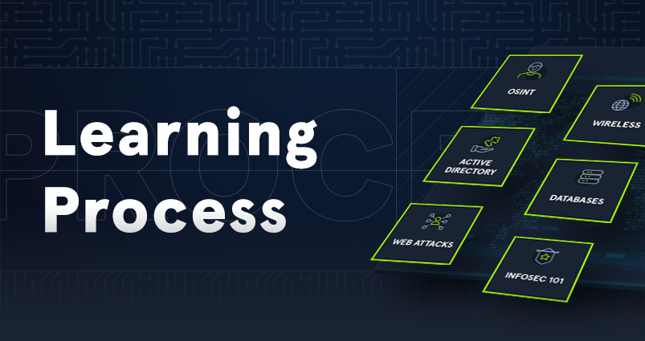

# Learning Process

| [{ .off-glb }](https://academy.hackthebox.com/course/preview/learning-process) |
|:---|
| The learning process is one of the essential and most important components that is often overlooked. This module does not teach you techniques to learn but describes the process of learning adapted to the field of information security. You will learn to understand how and when we learn best and increase and improve your learning efficiency greatly. |
