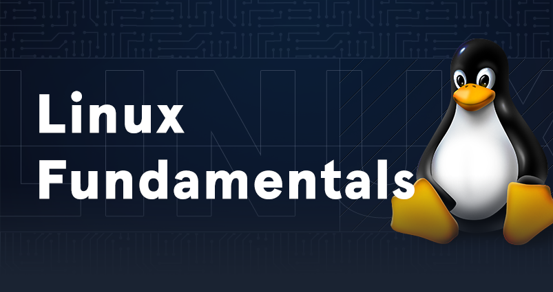

# Linux Fundamentals

| [{ .off-glb }](https://academy.hackthebox.com/course/preview/linux-fundamentals) |
|:---|
| This module covers the fundamentals required to work comfortably with the Linux operating system and shell. |
