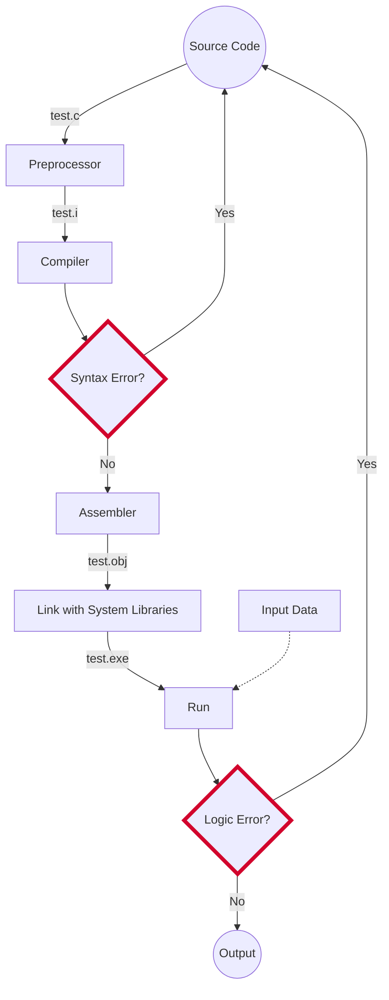

# Execution Process

```mermaid
graph TB
  classDef red stroke:#d2042d,stroke-width:5px;
  S((Source Code))
  P[Preprocessor]
  C[Compiler]
  E1{Syntax Error?}
  A[Assembler]
  L[Link with System Libraries]
  R[Run]
  I[Input Data]
  E2{Logic Error?}
  O((Output))
  S-->|test.c|P-->|test.i|C-->E1:::red
  E1-->|Yes|S
  E1-->|No|A-->|test.obj|L-->|test.exe|R-->E2:::red
  E2-->|Yes|S
  E2-->|No|O
  I-.->R
```
