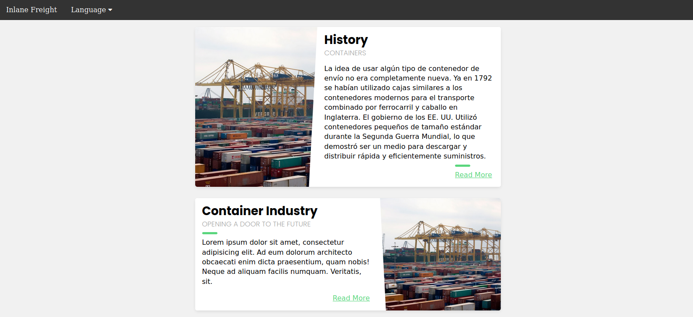
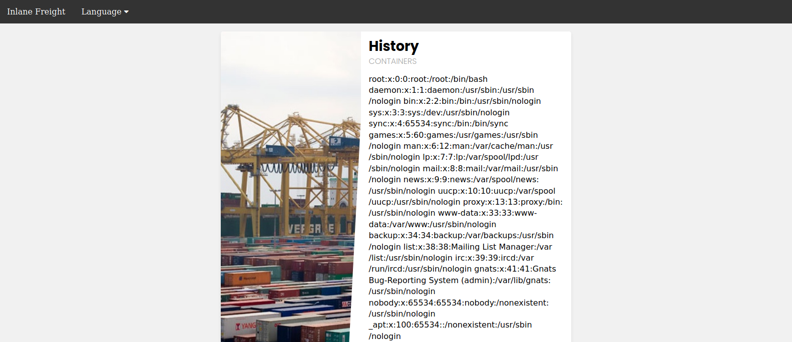

# Local File Inclusion (LFI)

## Basic LFI

Ele alacağımız siteye ait URL [http://SERVER_IP_ADDRESS:PORT/](http://SERVER_IP_ADDRESS:PORT/) olsun. Site dilini English veya Spanish olarak ayarlayabiliyor olalım:


Örneğin site dilini Spanish olarak değiştirdiğimizde URL [http://SERVER_IP_ADDRESS:PORT/index.php?language=es.php](http://SERVER_IP_ADDRESS:PORT/index.php?language=es.php) olarak değişmektedir:



Basic LFI zafiyetinin varlığını kontrol etmek için GET parametresini `?language=/etc/passwd` olarak değiştirmeyi deneyelim:



Görüldüğü gibi yerel parola dosyasının içeriğini siteye ekleyebildik (LFI). Bu işlemin başaralı olabilmesi için sitenin kaynak kodunda aşağıdaki gibi bir satır olmalıdır:

```php
include($_GET['language']);
```

## Path Traversal

Sitenin kaynak kodunda aşağıdaki gibi bir satır olsun:

```php
include("./languages/" . $_GET['language']);
```

Bu durumda, Basic LFI kısmında bahsedilen yöntem (`/etc/passwd`) işe yaramayacaktır. Çünkü GET parametresini aynı şekilde verdiğimizde, mevcut olmayan bir dosya yolu (`./languages//etc/passwd`) talep etmiş oluruz.

* [x] Bunun için GET parametresini `?language=../../../etc/passwd` olarak değiştirmeyi deneyebiliriz.

## Filename Prefix

Sitenin kaynak kodunda aşağıdaki gibi bir satır olsun:

```php
include("lang_" . $_GET['language']);
```

Bu durumda, Path Traversal kısmında bahsedilen yöntem (`../../../etc/passwd`) işe yaramayacaktır. Çünkü GET parametresini aynı şekilde verdiğimizde, mevcut olmayan bir dosya yolu (`lang_../../../etc/passwd`) talep etmiş oluruz.

* [x] Bunun için GET parametresini `?language=/../../../etc/passwd` olarak değiştirmeyi deneyebiliriz.

## Second-Order Attacks

Daha önceden hesap açtığımız bir web uygulamasındaki profil resmimizi, belirli bir URL üzerinden (`/profile/$username/avatar.png`) indirebiliyor olalım. Kayıt esnasında, kullanıcı adı olarak bir LFI dizesi (örneğin `../../../etc/passwd`) kullanırsak, kendi profil resmimiz yerine sunucudaki bir yerel dosyayı indirmemiz mümkün olabilir.

Bu yöntem ile veri tabanında bulunan bir girdiyi zehirlemiş oluruz. Sonrasında başka bir web uygulamasına ait bir işlev, bu zehirli girdiyi kullanarak saldırının gerçekleşmesine katkı sağlar. Bu saldırıların, Second-Order saldırıları olarak isimlendirilmesinin sebebi budur.

Geliştiriciler, kullanıcı girdisine karşı koruma sağlarken, Second-Order tarzı güvenlik açıklarını genelde gözden kaçırırlar. Çünkü, kendi veri tabanlarından alınan bir girdi çoğu zaman daha güvenli kabul edilir.
