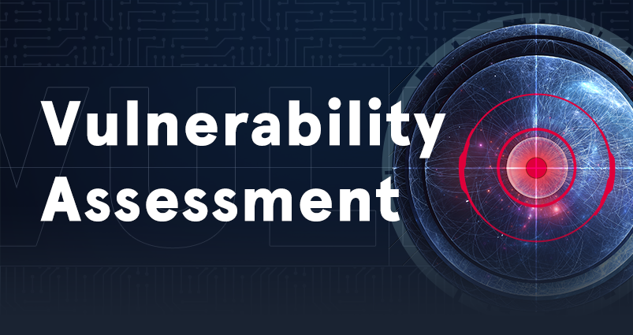

# Vulnerability Assessment

| [{ .off-glb }](https://academy.hackthebox.com/course/preview/vulnerability-assessment) |
|:---|
| This module introduces the concept of Vulnerability Assessments. We will review the differences between vulnerability assessments and penetration tests, how to carry out a vulnerability assessment, how to interpret the assessment results, and how to deliver an effective vulnerability assessment report. |
